# Deep Mastery Lab


Deep Mastery Lab is a full-coverage learning system built for dense study material — textbooks, certification guides, and technical references where each sentence matters. It processes your material into a structured learning path: read a paragraph, confront it with multiple-choice questions grounded in the source, then move forward. It is also powered by the FSRS spaced repetition algorithm, which schedules reviews across all your courses to lock in what you've learned. The goal is to finish a course with full confidence, no gaps, and everything committed to long-term memory.

> **Try the demo** — [Live Demo](https://deep-mastery-lab.streamlit.app/) · No API key required to test the main features.

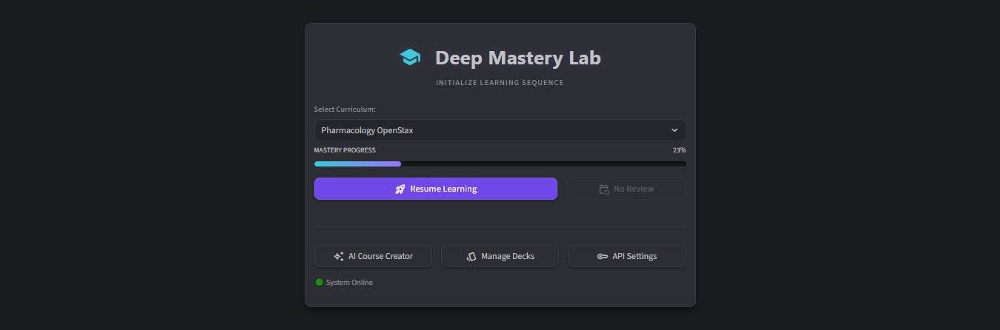


---

## Table of Contents

- [Motivation](#motivation)
- [What existing tools miss](#what-existing-tools-miss)
  - [Anki cloze](#anki-cloze)
  - [AI tutors](#ai-tutors)
- [Design Philosophy](#design-philosophy)
- [Features](#features)
- [Learning Flow](#learning-flow)
  - [Course Generation](#learning-flow-course-generation)
  - [Reading](#learning-flow-reading)
  - [Test](#learning-flow-test)
  - [Feedback](#learning-flow-feedback)
  - [Prefetch](#learning-flow-prefetch)
  - [SRS](#learning-flow-srs)
- [Themes](#themes)
- [LLM Integration](#llm-integration)
- [Installation](#installation)
- [License](#license)

---

## Motivation

After years of Anki cloze grind I realized I couldn't actually discuss, explain, or write about most of what I'd "learned." I could recognize answers but couldn't produce knowledge on demand. Even if the knowledge was available during exams the retrieval felt very disconnected. 

After experimenting with various tools, I discovered that the most effective method was simply reading the original material and answering multiple-choice questions (MCQs) generated by an LLM after each section. After couple of sessions of using this workflow I could casually explain material much better than it was with cloze grind. It seems that the MCQ format forces retrieval in a way that cloze deletion doesn't. When you encounter a question right after reading a section, you have to recall what the paragraph said, evaluate why the wrong options are wrong, and justify the correct answer — all of which cement the initial encoding into much stronger memory.

The workflow was still painful though: copy an excerpt from the book, ask an AI to generate questions, fight attention drift, then manually copy results into Anki for later review. Each handoff broke focus and added friction.

Deep Mastery Lab was built to close that loop — a single environment that handles source ingestion, question generation, and spaced repetition scheduling together, so the only thing left to do is learn.

---

## What existing tools miss

### Anki cloze

Cloze is excellent for vocabulary and isolated facts. For building usable knowledge from dense material, it has structural limits:

- **You are training yourself like a language model.** Cloze asks: *what word fits this gap?* That is literally next-token prediction — the same task LLMs are trained on. You learn to recognise a missing word in a sentence you already know, not to understand the concept behind it. The skill doesn't transfer — you can ingrain an entire chapter and still be unable to discuss, explain, or write about it.
- **High setup cost.** Converting dense text into cloze cards is a job in itself. The labour often kills interest before studying begins. Many topics never get started at all.
- **Failure means repetition, not understanding.** A failed card gets shorter intervals and comes back sooner. There is no mechanism to re-engage with the concept — just more exposure to the same isolated fragment.
- **No coverage guarantee.** You decide what to card, which means gaps are invisible. What you don't card, you don't study.

| Problem | How Deep Mastery Lab addresses it |
|---|---|
| Recognition only | MCQ requires active recall and application, not pattern-matching a gap |
| Setup cost | Source text → course in under 10 minutes, no card authoring |
| Failure loop | Failed items trigger the Mastery Path — re-read the source, test full comprehension |
| Coverage gaps | Every paragraph is tested in order; nothing is skipped |

---

### AI tutors

AI tutors have their own failure modes:

- **Selective coverage.** Paste a whole chapter and the AI decides 20% of it is worth teaching. The rest vanishes. You don't know what you missed.
- **Quality drift.** Question quality degrades over a long conversation. Re-prompting to restore it destroys the flow entirely.
- **Hallucination without warning.** Tools like NotebookLM will teach you fabricated knowledge with full confidence, or omit concepts that are critical for exams.
- **Socratic pacing is too slow.** You can spend hours on a single concept that should take ten minutes. There is no rhythm, no forward momentum.
- **Fake SRS.** "Commit this session to memory and test me in a few days" is not spaced repetition. It's optimistic and unreliable.

The deeper problem is attention drift. Without a forcing structure, the AI wanders, the user wanders, and coverage becomes accidental.


| Problem | How Deep Mastery Lab addresses it |
|---|---|
| Selective AI coverage | State machine walks every lesson in order — nothing is skipped |
| Quality drift | Each card and question is generated independently from the source text, never from conversation history |
| Hallucination | All content is grounded in your source material with laser precision |
| Slow Socratic pacing | Short card → short test → next card. No open-ended conversation |
| Fake SRS | Modern FSRS-based spaced repetition built in, scheduling across all courses |

The core design principle is **low input, maximum engagement**: read, answer a few questions, move forward. Repeat in short focused bursts polishing concentration and deep work skills.

---

## Learning Flow: Course Generation

The course generator accepts raw text only. Preparation takes around 5 minutes per chapter — the rest of the time is spent on actual learning.

**Preparing the source text:**
- Mark section boundaries with ## headers — the generator uses these to divide lessons by topic.
- Convert any bullet lists, tables, or visual material into prose for anything you intend to memorise — media can be added later
- Use high-quality, respected source material for the topic. A well-regarded textbook or reference will produce better results than a popular summary
- Avoid LLM-processed text — NotebookLM summaries, deep research documents, and AI syntheses are frequently inaccurate, which is dangerous for deep mastery work

**What the generator does:**

The generator is 90% deterministic. Its job is to divide the material into paragraphs, calculate content density, and group paragraphs into modules. Modules serve as summarisation points and psychological landmarks — markers that give the learner a sense of progress through the material. Module and lesson names are the only things the AI generates; the source text is never rewritten or paraphrased.

Modules can be divided thematically by hand for a more polished structure, but this is optional and rarely affects the learning experience significantly.

**Working with PDFs:**

If your source is a PDF with text that is difficult to copy accurately, use the included [PDF extraction prompt](prompt_for_pdf_extraction.md) with Claude. It produces clean, prose-formatted output suitable for direct import, with instructions for handling dense slides, tables, and diagrams without loss of detail.

<p>
  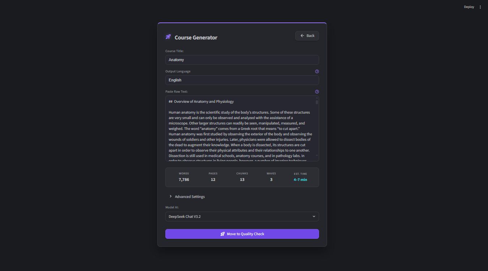
  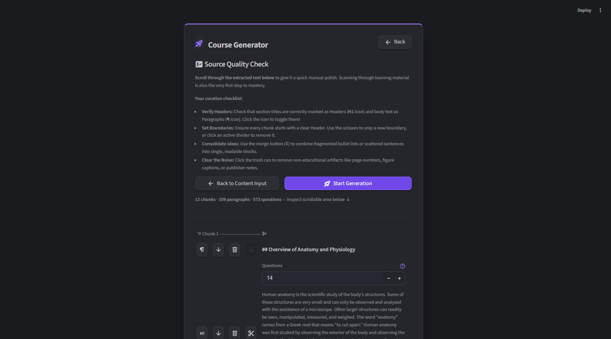
</p>

---

## Learning Flow: Reading

Each reading session presents a single paragraph from the source material. After reading, you answer a generated test and must pass an 80% threshold to advance. This granular approach is designed for high-stakes, deep learning where full coverage matters.

The card has two modes that can be switched at any moment based on preference:

- **Raw mode** (default) presents the original source text directly. It offers the best speed and flow — no processing overhead, no interpretation layer between you and the material.
- **AI Presentation mode** rewrites the same paragraph as a structured explanation that connects it to what came before and frames what comes next. It is intended for material that is dense, technical, or entirely new to you — situations where slower digestion pays off.

Presentation mode also accepts custom prompts, which can change the style entirely:
- *"Present this in the style of Tolkien"*
- *"Explain this like I'm five"*

The source paragraph is always accessible regardless of mode, so you can cross-reference the original text at any point.

Every few lessons the flow pauses at a checkpoint, which includes a synthesis card summarising everything studied so far. The approach is granular by design, but the big picture is never out of reach.


<p>
  
  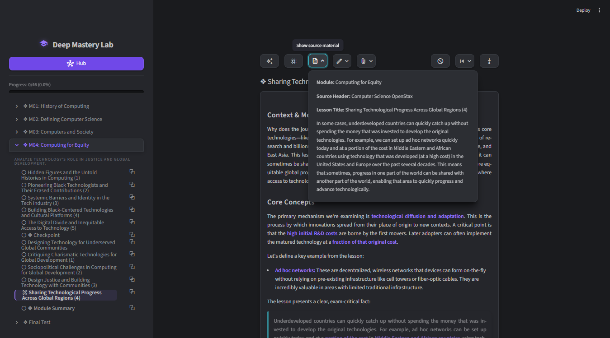
</p>
---

## Learning Flow: Test

Question count is calculated from the paragraph's structure and complexity. A short, simple paragraph might generate 2 questions; a dense or complex one can produce up to 20. The formula is adaptive.

Distractors are drawn from the course itself, sourced from concepts the user has already encountered or will encounter later. This keeps wrong answers plausible and relevant rather than generic.

To avoid using positional and sequential memory both (A B C D) options and the order of questions are shuffled. The shuffling happens all the time both in the main learning flow and in the reviews. 

Full control over the question pool is available at any time:
- **Delete** questions that don't add value
- **Regenerate** with an extra instruction explaining what the current batch missed
- **Edit** individual questions manually when a paragraph was interpreted too literally

LLM generation is reliable most of the time, but some curation is expected. Non-deterministic systems have natural limits that no prompt engineering fully eliminates.

Checkpoint tests appear every few lessons at module boundaries. There are three types:
- **Module Checkpoint** — a broader review accompanied by a synthesis card that summarises all lessons covered so far in the module. 
- **Module Synthesis** — tests the current module's material, also accompanied by a synthesis card.
- **Final Test** — covers the entire course

These serve as structured pauses in the normal flow, giving the material time to consolidate before moving forward.

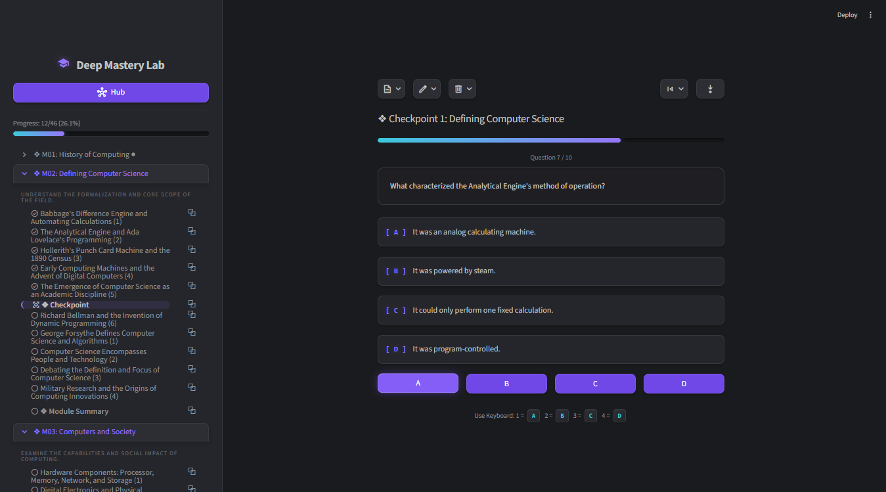

---

## Learning Flow: Feedback

Every test ends on a feedback screen. Failed questions are shown alongside the relevant source material, so you can immediately see what the paragraph actually said versus what you answered. There is no guessing what you missed.

From the feedback screen you can:
- **Continue** to the next lesson or the next review batch
- **Enter the Mastery Path** for any failed question — a targeted recovery journey that takes you back to the source lesson, lets you re-read it, and tests full comprehension before returning to the main flow

This built-in recovery step is why failing cards are not re-shown the same day. The feedback screen plus the optional Mastery Path already handles relearning in a deeper way than immediate re-exposure would.

<p>
  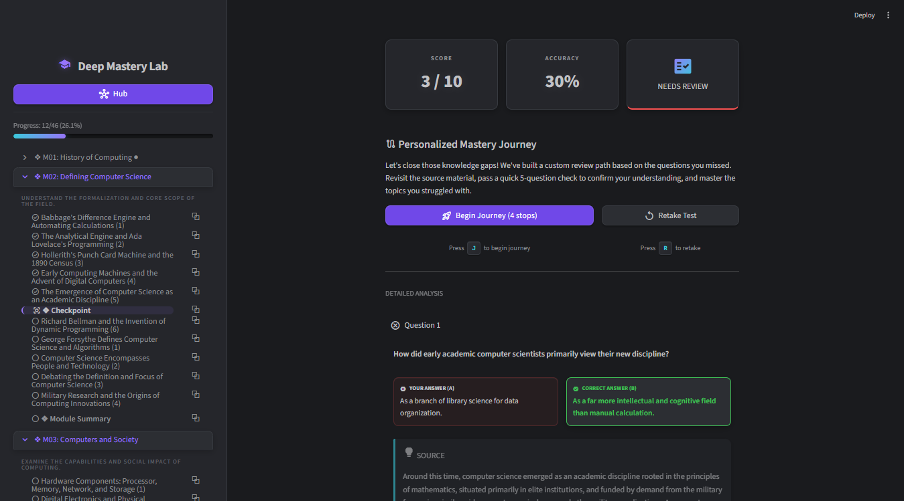
  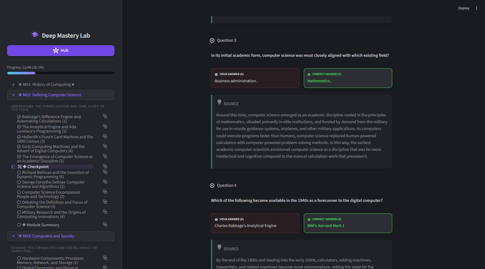
</p>

---

## Learning Flow: Prefetch

While you read a card or answer a test, the app is already generating the next lessons' cards and questions in the background. By the time you click Next, the content is ready. There is no waiting between states — no spinner between every lesson that breaks focus.

The first one or two lessons are the only exception. No content exists yet at that point, so a short wait on first launch is expected.

---

## Learning Flow: SRS

The SRS system is built on FSRS — the same modern spaced repetition algorithm used in current versions of Anki. Reviews are drawn from all courses into a single unified deck, making it the central hub for everything you have learned.

FSRS is designed around minimising unnecessary review. Unlike older algorithms, it does not schedule reviews too early — cards are only surfaced when forgetting is actually likely. This keeps the daily review load small and predictable. FSRS also uses fuzzy scheduling: intervals are slightly randomised so reviews spread naturally across days. 

**Learning steps are disabled.** The initial learning phase happens in the reading and test flow — by the time a card enters SRS it has already been studied and tested. There is nothing to introduce.

**Relearning steps are also disabled.** Failing a card does not drop it into a repetition loop. Instead, you can optionally enter the **Mastery Path** — a short recovery journey that takes you back to the source lessons the question came from. You re-read the material and answer a 5-question test covering the full concept, not just the atomic fact you failed on. This targets comprehension rather than rote correction.

Reviews are bucketed by calendar day, with each new day starting at 4:00 AM. This keeps late-evening study sessions from pulling in the next day's reviews and disrupting the schedule.

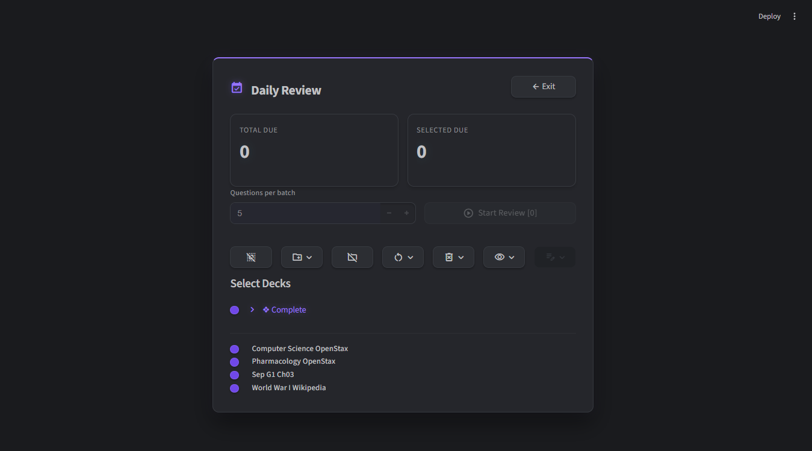


---

## Themes

Being stuck with a single look for every study session is quietly draining. Deep Mastery Lab ships with a large collection of themes — mostly low-contrast and dark designs chosen to reduce eye fatigue and keep sessions comfortable over long stretches. 

<p>
  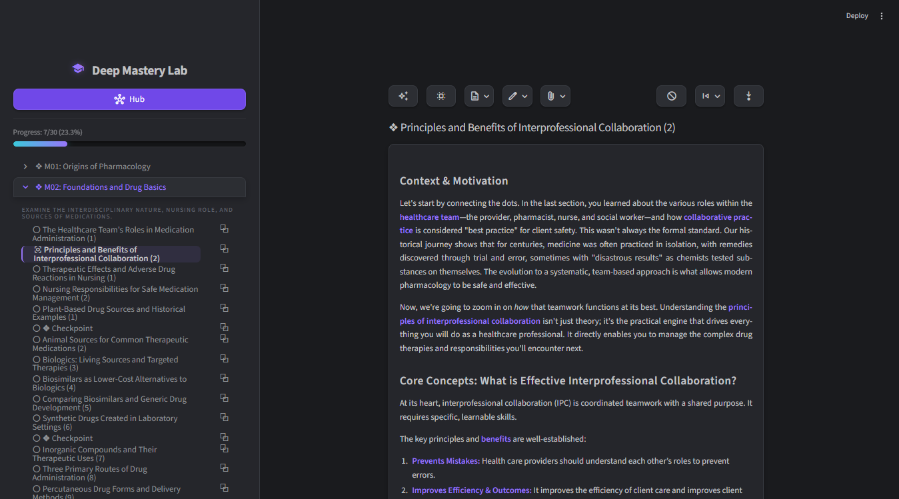
  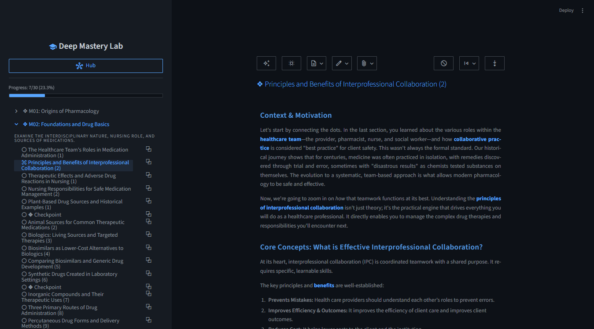
</p>
<p>
  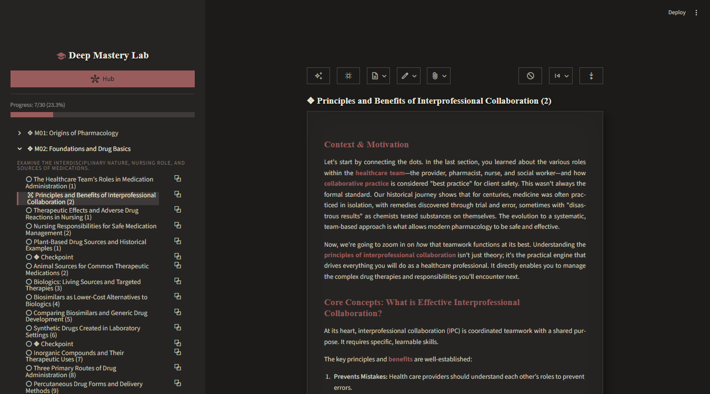
  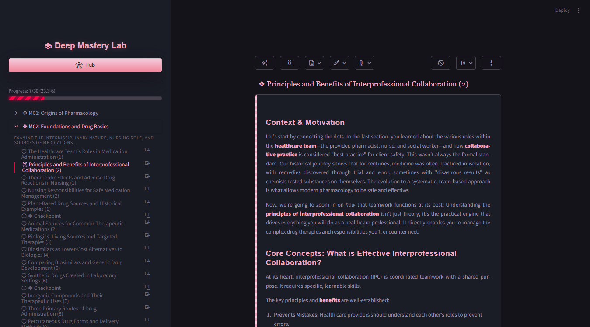
</p>

---

## LLM Integration

The app requires an API key from one of the supported providers: Anthropic, Google, OpenAI, OpenRouter, or DeepSeek.

**OpenRouter** is the best choice for exploration — it gives access to many models through a single key, making it easy to compare output quality and track costs across providers.

**DeepSeek** is the recommended choice for daily use. It offers the best combination of speed, reliability, and cost for the workload this app generates.

**Typical costs with DeepSeek:**
- A single academic book: ~$3
- A full curriculum: under $20
- If you use DeepSeek for MCQ only you can learn for years with 20$ worth of tokens. 

---

## Features

- **Paragraph-level question pools** — every block of content gets tested, not just the parts the AI finds interesting
- **Full coverage guarantee** — a flat syllabus state machine ensures every lesson and checkpoint is visited
- **FSRS spaced repetition** across all courses in a single unified deck
- **Multiple LLM providers** — OpenAI, Anthropic, Google, OpenRouter, and DeepSeek
- **Background prefetching** — cards and questions for upcoming lessons are generated while you study the current one
- **Full-screen deep work mode** — learning source, card, test, and SRS all in one place, no window switching
- **AI lesson cards** generated on demand from your source text
- **Per-course progress and cost tracking**

---

## Installation

### Requirements

**Python 3.11 or newer** (developed and tested on 3.13)
Download from [python.org/downloads](https://www.python.org/downloads/).
During installation, check **"Add Python to PATH"** — without this the app will not start.

> If you missed the PATH checkbox, uninstall Python and reinstall with it checked.

**An API key from one of the supported providers:**
| Provider | Best for | Link |
|---|---|---|
| DeepSeek | Daily use — fastest and cheapest | [platform.deepseek.com](https://platform.deepseek.com) |
| OpenRouter | Testing models, comparing costs | [openrouter.ai](https://openrouter.ai) |
| Anthropic / Google / OpenAI | Alternatives | provider dashboards |

You enter the key inside the app on first launch — no config files to edit manually.

---

### Option A — Git clone

Requires [Git](https://git-scm.com/downloads) installed.

**Install (one time):**

Navigate in Windows Explorer to the folder where you want to install the app. `Shift + Right-click` on an empty area inside it and choose **Open in Terminal** (or **Open PowerShell window here** on older Windows). Then paste all of the following at once and press Enter:

```bash
git clone https://github.com/piotrszmyt-dev/deep-mastery-lab
cd deep-mastery-lab
python -m venv venv
venv\Scripts\activate
pip install -r requirements.txt
```

This creates a `deep-mastery-lab` folder in your chosen location with everything installed inside it.

**Start the app:**

Open a terminal inside the `deep-mastery-lab` folder the same way (`Shift + Right-click` → **Open in Terminal**) and run:

```bash
venv\Scripts\activate
streamlit run app.py
```

The app opens automatically at `http://localhost:8501`.

Or skip the terminal entirely — double-click `Start Deep Mastery Lab.bat` inside the folder and it handles everything.

To update later:
```bash
git pull
venv\Scripts\activate
pip install -r requirements.txt
```

---

### Option B — ZIP package

1. Download the ZIP from the [Releases](https://github.com/piotrszmyt-dev/deep-mastery-lab/releases) page and extract it anywhere
2. Double-click **`install.bat`** — this installs all dependencies (one time only)
3. Double-click **`Start Deep Mastery Lab.bat`** to launch

The app opens automatically in your browser. Use the start file every time you want to run the app.

To update: download the new ZIP, extract it to a new folder, run `install.bat`, then copy your `data\` folder from the old installation — it contains all your courses, progress, and SRS history. Alternatively, install [Git](https://git-scm.com/downloads) and switch to Option A, which handles updates in three commands.

---

## Design Philosophy

This app is built for personal learning of high-density study material. The goal is not to replace deep reading or thinking — it is to replace the parts of studying that waste time without building understanding: re-reading passively without accountability, drilling cloze without transfer, or drifting through AI conversations without moving forward.

The measure of success is simple: finish the material, remember it later, use it.

---

## License

This project is licensed under the [GNU Affero General Public License v3.0 (AGPL v3)](https://www.gnu.org/licenses/agpl-3.0.html).

You are free to use, study, and improve this software. Any modified version must also be released under AGPL v3. Commercial use and commercial forks are not permitted without explicit written permission from the author.
